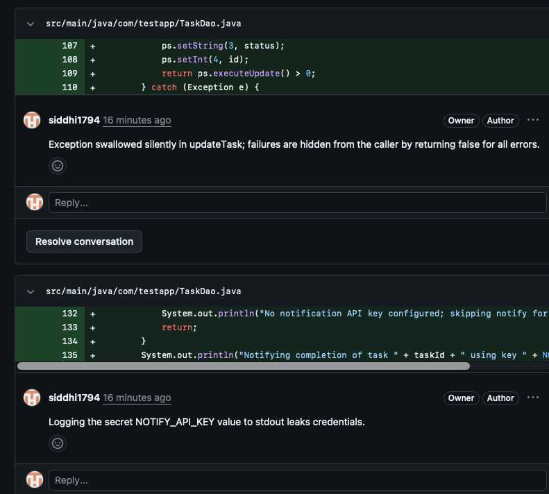

# AI-Code-Review-Bot

[](https://github.com/siddhi1794/AI-Code-Review-Bot/actions/workflows/ci.yml)

AI Code Review Bot — automated GitHub PR reviewer built with TypeScript/Node.js, Express, and the Anthropic API, using async job processing (BullMQ) and webhook-driven architecture to surface code quality and security issues in real time.

## Example

A pull request review from the real Claude Opus 4.8 provider (`AI_PROVIDER=anthropic`), posted as an inline comment via the GitHub Reviews API:



## Architecture

```
GitHub PR event ──▶ POST /api/webhook ──▶ enqueue job ──▶ BullMQ worker ──▶ GitHub Reviews API
  (opened/           (HMAC signature        (Redis)         (fetch diff,      (inline comments
   synchronize/        verification,                         run AI review,    + summary)
   reopened)           fast 202 response)                     validate lines)
```

A few deliberate design choices:

- **Webhook receipt is decoupled from review work.** GitHub expects a fast response to a webhook delivery; the actual review (fetching the diff, calling Claude, posting comments) can take several seconds. The webhook handler just verifies the HMAC signature and enqueues a BullMQ job — a separate worker process does the slow part, with automatic retries (3 attempts, exponential backoff) if the GitHub or Anthropic API call fails.
- **AI provider is swappable.** `AI_PROVIDER=mock` runs a heuristic reviewer with zero external dependencies (used in tests and local dev); `AI_PROVIDER=anthropic` swaps in a real Claude Opus 4.8 call with structured JSON output. Both implement the same `ReviewFinding[]` shape, so the worker doesn't care which one produced it.
- **Line numbers are always validated against the diff.** GitHub's inline-comment API rejects any line that isn't part of the pull request's diff. Whether findings come from the mock or from Claude, they're checked against the actual added-line set before being posted, so a hallucinated or stale line number can't break the review.

## Quick start (MVP)

Create a `.env` file with:

```
GITHUB_TOKEN=your_personal_access_token
WEBHOOK_SECRET=your_webhook_secret
REDIS_URL=redis://127.0.0.1:6379
PORT=3000
ANTHROPIC_API_KEY=your_anthropic_api_key
AI_PROVIDER=mock
```

`AI_PROVIDER` controls which review engine runs:

- `mock` (default) — heuristic-only, no API key or network calls required. Good for local development.
- `anthropic` — sends the PR diff to Claude Opus 4.8 and posts its structured findings as inline comments. Requires `ANTHROPIC_API_KEY`.

Install dependencies:

```bash
npm install
```

You'll also need a local Redis instance running (used by BullMQ for the job queue), e.g.:

```bash
redis-server
# or: docker run -p 6379:6379 redis
```

Run the app in dev mode (auto-restarts on file changes):

```bash
npm run dev
```

Expose `/api/webhook` with your repository webhook, sign payloads using `WEBHOOK_SECRET`, and the service will enqueue PR review jobs and post the results as inline comments on the pull request.

## Development

**Validate the server starts up correctly:**

```bash
npm run dev
```

You should see `AI Code Review Bot listening on port 3000` in the console. In another terminal, confirm the health endpoint responds:

```bash
curl http://localhost:3000/health
# {"status":"ok","service":"ai-code-review-bot"}
```

**Typecheck without emitting output:**

```bash
npm run typecheck
```

**Run the test suite** (config loading, webhook signature verification, GitHub service calls — all mocked, no real network/Redis calls):

```bash
npm test
```

**Lint:**

```bash
npm run lint
```

